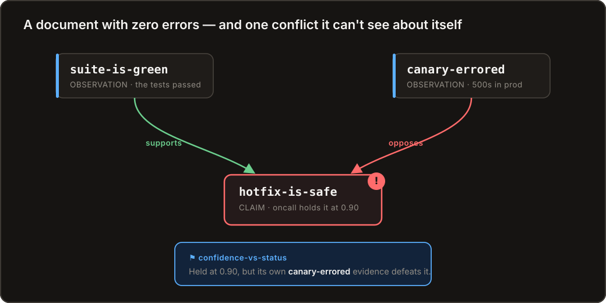
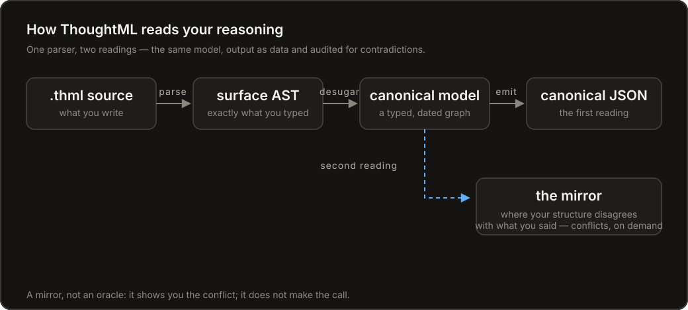

<p align="center">
  <picture>
    <source media="(prefers-color-scheme: dark)" srcset="assets/wordmark-dark.svg" />
    
  </picture>
</p>

<p align="center"><strong>A plain-text language for reasoning you can check.</strong></p>

<p align="center">
  <a href="https://fatin-ishraq.github.io/ThoughtML/">📖 Book</a> &nbsp;·&nbsp;
  <a href="https://fatin-ishraq.github.io/ThoughtML/playground/">▶ Playground</a> &nbsp;·&nbsp;
  <a href="examples">📁 Examples</a>
</p>

<p align="center">
  <a href="https://fatin-ishraq.github.io/ThoughtML/"></a>
  <a href="https://fatin-ishraq.github.io/ThoughtML/playground/"></a>
  <a href="https://github.com/Fatin-Ishraq/ThoughtML/actions/workflows/ci.yml"></a>
  <a href="LICENSE"></a>
  <a href="CHANGELOG.md"></a>
</p>

<p align="center">
  
</p>

---

Prose is good at *stating* a conclusion and terrible at *showing its shape*. You can
write three confident paragraphs that quietly contradict themselves, and no tool will
say a word.

ThoughtML is a small language that fixes that. You write down what you believe and
**why** — claims, evidence, who holds what, how confident, as of when — and it reads
back a typed, dated, defeasible graph. Then it reads that graph a *second* time,
mechanically, and tells you where your own structure disagrees with what you said.

> **It's a mirror, not an oracle.** It shows you the conflict. It does not make the call.

## Watch it catch a mistake

A hiring decision, written as ThoughtML:

```thml
focus strong-hire
  kind claim
  Alex is a strong hire.

focus aced-interview
  kind observation
  Aced the system-design round.

focus take-home-failed
  kind observation
  The take-home didn't run — tests were failing.

link aced-interview supports strong-hire
link take-home-failed opposes strong-hire

panel holds strong-hire
  confidence 0.9 assumed
```

This document is **clean** — zero errors, zero warnings. The syntax is perfect. And
yet it's *wrong*, in a way no spell-checker or linter would ever catch. Run the mirror
over it (`thoughtml --audit`):

```json
"audit": {
  "conflicts": [
    {
      "kind": "confidence-vs-status",
      "severity": "error",
      "message": "`panel` asserts confidence 0.90 in `strong-hire`, but your own structure defeats it (argument status: out)"
    }
  ]
}
```

The panel is **90% sure** of a claim its *own recorded evidence* defeats — it wrote
down that the take-home failed, then made the offer anyway. Nothing about the text is
malformed; the *reasoning* is. ThoughtML surfaces that gap and hands it back to you.
(And that `0.9` labels itself `assumed`, not measured — provenance you can see.)

That's the whole idea in one screen.

<p align="center">
  <a href="https://fatin-ishraq.github.io/ThoughtML/playground/"><strong>▶ &nbsp;Try it live in your browser →</strong></a><br/>
  <sub>the real parser, compiled to WebAssembly — type on the left, watch the reasoning graph build on the right. No install.</sub>
</p>

## Why now

For as long as reasoning has been expensive to produce, it made sense to trust it by
default. That's changing. An AI agent can now emit pages of structured argument at no
cost — which means the scarce, valuable thing is no longer *producing* reasoning but
**auditing** it.

ThoughtML is built for that world. The agent (or you) writes the reasoning down in a
form that's explicit enough to check; a human, another agent, or CI reads it back and
catches where the confidence betrays the structure. The point was never to *compute
the answer.* It's to make reasoning legible enough that its flaws can't hide.

> **Writing ThoughtML with an AI?** The whole language travels *inside the tool*. Run
> `thoughtml guide --full` for the complete, source-derived spec (or read
> [`llms.txt`](crates/thoughtml/llms.txt)) and paste it into a system prompt. `thoughtml
> guide` alone prints a one-screen tour; `thoughtml guide <topic>` looks up one section.

## The concepts

- **Typed reasoning.** A focus is an `observation`, `claim`, `hypothesis`, `option`,
  `decision`, `goal`, `assumption`, … — not just a box. Foci nest into *thought-trees*:
  a claim and the reasoning that hangs off it, as one unit.
- **Defeasible evidence.** `supports` / `opposes` / `undercuts` form an argument graph;
  an opt-in grounded status reads every node as `in` / `out` / `undecided`. Purely
  structural relations (`part-of`, `candidate-for`) let you *enumerate* without
  silently inflating confidence.
- **Time is the spine.** Beliefs are dated and ordered by valid-time. They can be
  revised, and a dead end can be `abandoned` — *kept with its reason, not deleted*.
  Redefining a focus never clobbers the first version; both are retained. Replay the
  whole thing as of any instant (`--as-of`, or the viewer's play button). Nothing is
  forgotten.
- **Honest numbers.** One strength encoding — a numeric `weight` — and every authored
  number can declare its basis: `measured` / `estimated` / `assumed`.
- **The mirror.** An opt-in conflict report flags where your structure disagrees with
  what you said: high confidence in a claim your own evidence defeats
  (`confidence-vs-status`), or the same focus defined two incompatible ways
  (`definition-divergence`). It reports; it does not decide.
- **Projects with provenance.** Split long-running reasoning across imported `.thml`
  modules without losing the unified graph. Every compiled object retains its source
  file and line; imported conclusions can reveal their supporting module reasoning in
  place and collapse back into the project overview.

## What's in the repo

ThoughtML is a *language*; this repo is its **reference implementation**. One parser is
the single source of truth — everything else is that same parser wearing a different
hat, so the browser, the CLI, and the exported file can never disagree.

<p align="center">
  
</p>

| Piece | What it is | |
|---|---|---|
| **Reference parser** | Rust: source → surface AST → canonical objects → JSON, with diagnostics. The source of truth for the language. | [`crates/thoughtml`](crates/thoughtml) |
| **CLI toolchain** | The parser as git-style subcommands — `check`, `fmt`, `explain`, `diff`, `stream` — plus the mirror (`--audit`), the compute layer (`--compute`), as-of replay (`--as-of`), and standalone HTML export (`--html`). | same crate |
| **wasm build** | The *same* parser compiled for the web, so the playground and the CLI can't drift. | [`crates/thoughtml-wasm`](crates/thoughtml-wasm) |
| **Playground** | Persistent multi-file editor + unified reasoning graph: a time-driven **Viewer** with replay and Follow narration, a node-link **Structural** view, source-aware Reasoning Cards, and standalone/project export. | [`web`](web) · [live ↗](https://fatin-ishraq.github.io/ThoughtML/playground/) |
| **The book** | Tutorial, complete language reference, the mirror, and practical guides. | [`docs`](docs) · [live ↗](https://fatin-ishraq.github.io/ThoughtML/) |
| **`llms.txt`** | The whole language in one file — embedded in the binary, so `thoughtml guide --full` prints it too. | [`llms.txt`](crates/thoughtml/llms.txt) |
| **Example gallery** | 10 worked, strict-clean standalone documents plus a six-file Snake project — a concrete pour caught by its own evidence, a waterborne-outbreak investigation, two referees on one paper, a re-dated manuscript, a funding panel, an irrigation budget that computes itself, a wildfire evacuation call, and an import pair. | [`examples`](examples) |

## Install & run

You don't need any Rust to *use* the language — only to run the reference
implementation.

**Install the CLI** — pick your ecosystem; all three ship the *same* binary, no Rust required:

```sh
pip install thoughtml          # Python
npm install -g thoughtml       # Node
cargo install thoughtml        # Rust
```

Prebuilt binaries for macOS, Linux, and Windows are attached to every
[release](https://github.com/Fatin-Ishraq/ThoughtML/releases).

**Run the toolchain** — the bare `thoughtml <file>` still emits the canonical JSON model:

```sh
thoughtml guide                                       # the language itself, one screen (--full for all of it)
thoughtml examples/pour-the-slab.thml               # canonical JSON + diagnostics
thoughtml --audit examples/pour-the-slab.thml       # the mirror: where structure disagrees
thoughtml check --json doc.thml                         # diagnostics with stable codes + suggested fixes
thoughtml fmt -w doc.thml                               # format in the one canonical style
thoughtml explain doc.thml some-claim                   # why a node has its confidence / status
thoughtml diff before.thml after.thml                   # a semantic, belief-level diff
thoughtml --html -o record.html examples/grant-panel.thml   # bake to one interactive HTML file
thoughtml stream doc.thml                          # host a live view on this computer
```

`thoughtml stream` watches the entry document and its imported files, recompiles
locally after settled edits, and gives you a live read-only link. It binds to
`127.0.0.1` by default; add `--lan` to share with devices on a trusted local
network. It uploads nothing, requires no account, and works only while that
computer and command are running. Private links use secure random tokens; use
`thoughtml stream status` and `thoughtml stream stop`, or `--json --events` for
an agent-friendly lifecycle.

Full reference: [The CLI ↗](https://fatin-ishraq.github.io/ThoughtML/guides/cli.html).
Prefer not to install? Run any of it via `cargo run -p thoughtml -- …`, or just open the
[playground](https://fatin-ishraq.github.io/ThoughtML/playground/).

The playground is also a local multi-file editor: open a real `.thoughtml/`
directory, edit sibling imports in persistent tabs, save back to disk, search
the project, and jump from diagnostics or graph nodes to compiler-provided
source locations. It detects external agent edits and protects conflicts rather
than silently overwriting them. Compilation runs in a worker and produces one
unified graph without uploading the selected `.thml` files. The included
six-file Snake project is a ready-made example.

In a unified project graph, imported conclusions stay compact. A subtle stacked-node
mark indicates that more reasoning is available; select the node and use **Expand
reasoning** in its floating card to reveal only the supporting ancestry from that
module. **Collapse reasoning** returns to the overview without navigating away.

**Hack on the playground locally:**

```sh
cd web && npm install
npm run wasm    # build the parser to wasm (uses the rustup toolchain)
npm run dev
```

## What you'd use it for

- **Decision records (ADRs) you can lint** — the options, the evidence, and the open
  question that blocks sign-off, all checkable.
- **AI-agent reasoning a human or CI can audit** — the agent emits its reasoning; the
  mirror catches where its confidence betrays its own structure.
  ([guide ↗](https://fatin-ishraq.github.io/ThoughtML/guides/for-ai-agents.html))
- **Design & code review of an argument** — surface "you hold this at 0.9, but your own
  listed risk defeats it."
- **Incident postmortems** as checkable causal graphs, and **research / claim maps** with
  provenance on every number.

More in [Use cases ↗](https://fatin-ishraq.github.io/ThoughtML/guides/use-cases.html).

## Status

**v0.4.2 — follow-ups.** Closes a gap in 0.4.1's stream exposure check, stops
`thoughtml fmt` deleting comments, and fixes a wrong-answer bug in evidence
propagation found by the new continuous fuzzing.

**v0.4.1 — security release.** Upgrade from 0.4.0 or earlier: a security audit found
issues in the parser, the viewer, the `thoughtml stream` server, and the release
pipeline, and there is no configuration workaround for most of them. Nothing in the
language changed. Details are in [CHANGELOG.md](CHANGELOG.md) and the repository's
security advisories.

**v0.4.0 — connected reasoning.** ThoughtML now scales from one document to a living
project: persistent multi-file authoring, authoritative file/line provenance, a unified
graph with inline reasoning drill-down, computer-hosted live streams for long-running
agents, and self-contained snapshots. Semantic node shapes and one universal Reasoning
Card keep the playground, stream, and standalone viewer visually and behaviorally aligned.
The core language remains compatible with v0.3.0. The full trail is in
[CHANGELOG.md](CHANGELOG.md); the language and workflows are in the
[book](https://fatin-ishraq.github.io/ThoughtML/). The surface may still move — hence 0.x,
not 1.0. What 1.0 would freeze, and what it deliberately would not, is written
down in [STABILITY.md](STABILITY.md).

## Contributing

Issues and ideas are welcome — open one [here](https://github.com/Fatin-Ishraq/ThoughtML/issues).
The reference parser is the source of truth for the language and the docs are derived from
it, so if the two ever disagree, that's a bug worth reporting.
Maintainers preparing a tag should follow the complete [release checklist](RELEASING.md).

## License

[MIT](LICENSE) © 2026 Fatin Ishraq.
